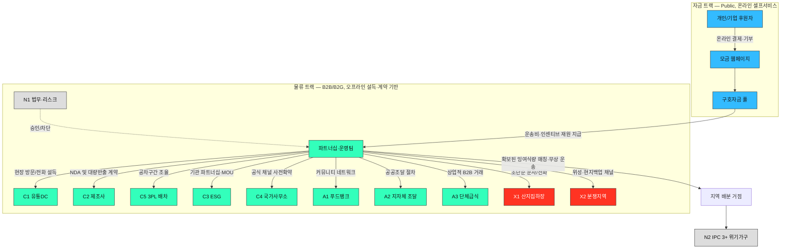

# 19 - 글로벌 잉여식량 재분배 플랫폼 — 페르소나 스펙트럼 (관점 수정판)

## 0. 서비스 정의 (수정된 전제)

이 서비스는 "여러 행위자가 자발적으로 온라인 플랫폼에 접속해 의사결정 의향을 직접 등록하는 오픈 셀프서비스 플랫폼"이 **아닙니다.**

실제 구조는 명확히 분리된 **두 개의 트랙**입니다.

1. **자금 트랙 (모금)**: 전 세계의 구호자금 가용 재원을 파악하고, 신규 구호자금 모금을 받는 **퍼블릭 웹페이지**. 여기서만 온라인 셀프서비스가 성립합니다 (후원자가 직접 결제·기부).
2. **물류 트랙 (잉여식량 확보 및 무상 운송)**: 유통·제조·물류·조달 담당자 등 아래 페르소나 스펙트럼의 대다수를 **플랫폼 운영팀이 사전에 직접 설득·협상·계약(MOU)** 해서 확보하는 B2B/B2G 파트너십 오퍼레이션입니다. 이들은 플랫폼에 로그인하지 않으며, 소프트웨어는 이들에게 보여지는 셀프서비스 UI가 아니라 **운영팀의 내부 CRM 및 물류 매칭 엔진**으로 기능합니다.

## 1. 페르소나 스펙트럼 (원본 다이어그램)

```mermaid
graph LR
    subgraph CORE["Core 핵심 5 — 주력 타깃"]
        direction TB
        C1["C1 「하루 안에」<br>유통 DC 재고 처분 담당<br>폐기와 같은 부담이면 내준다"]
        C2["C2 「팔레트 단위」<br>식품 제조사 공장 재고·품질 담당<br>브랜드만 안 드러나면 대량 반출"]
        C3["C3 「분기 마감」<br>본사 지속가능경영(ESG) 담당<br>검증 가능한 톤 수가 필요하다"]
        C4["C4 「3개월 앞」<br>국가사무소 물류·프로그램 오피서<br>확약 안 된 물량은 계획에 못 넣는다"]
        C5["C5 「빈 차로 돌아간다」<br>지역 물류사(3PL) 배차 담당<br>공차 구간을 채워주면 움직인다"]
    end

    subgraph ADJ["Adjacent 확장 3 — 유사 문제 · 다른 맥락"]
        direction TB
        A1["A1 「우리 동네 안에서」<br>도시권 푸드뱅크 운영자<br>같은 매칭 문제, 라스트마일 규모"]
        A2["A2 「감사에서 방어되는가」<br>지자체 식량·복지 조달 담당<br>이력 서류가 없으면 못 받는다"]
        A3["A3 「등급만 낮으면 된다」<br>단체급식·2차 가공 구매 담당<br>12명 중 유일하게 돈을 낸다"]
    end

    subgraph EXT["Extreme 극단 2 — 제약 상황 · 실패 중심"]
        direction TB
        X1["X1 「사흘 뒤엔 없다」<br>산지 집하장·농협 운영자<br>피처폰·문해 제약, 72시간 시한"]
        X2["X2 「국경이 오늘 닫혔다」<br>분쟁·봉쇄 지역 배분 담당<br>통신 두절, 목적지가 당일 바뀐다"]
    end

    subgraph NON["Non-user 비활성 2 — 진입 장벽"]
        direction TB
        N1["N1 「사고 나면 회사가 흔들린다」<br>법무·리스크 관리 담당<br>회피형 — C1·C3를 막는 규정 작성자"]
        N2["N2 「배급소에서 결과만 만난다」<br>IPC 3+ 위기 가구 구성원<br>비접근형 — 성과 판정의 기준"]
    end

    CORE --> ADJ
    CORE --> EXT
    ADJ --> NON

    classDef core fill:#33BBFF,stroke:#333,stroke-width:2px,color:#111;
    classDef adj fill:#33FFBB,stroke:#333,stroke-width:2px,color:#111;
    classDef ext fill:#FF3322,stroke:#333,stroke-width:2px,color:#fff;
    classDef non fill:#DDDDDD,stroke:#333,stroke-width:2px,color:#111;
    class C1,C2,C3,C4,C5 core;
    class A1,A2,A3 adj;
    class X1,X2 ext;
    class N1,N2 non;
```

## 2. 무엇이 잘못되었었는가

- **기존 전제**: C1~C5, A1~A3, X1~X2 열두 페르소나 전원이 온라인 플랫폼에 접속해 "우리 재고를 내놓겠다/받겠다"는 의사결정을 **직접 등록**한다고 가정했습니다.
- **실제로 맞는 유일한 예외**: 대중·기관 후원자의 모금 참여만 온라인 셀프서비스로 성립합니다. 그런데 이 스펙트럼 안에는 개인 후원자 페르소나 자체가 없고, C3(ESG 담당)조차 "기업 차원의 파트너십·기부 예산 승인"이라는 조직적 의사결정이지 개인의 셀프서비스 가입이 아닙니다.
- **나머지 전원(C1, C2, C4, C5, A1~A3, X1, X2)**은 예외 없이 **운영팀의 오프라인 설득·협상·계약**을 통해 확보되는 대상입니다. 폐기 비용 절감, 브랜드 익명성 보장, 공차 구간 채우기 같은 유인은 웹 UI로 전달되는 게 아니라 사람이 직접 만나거나 전화로 설명해야 설득력이 생깁니다.
- **N1(법무·리스크)**은 애초에 "사용자"가 아니라, 파트너십 체결의 승인·거부권을 쥔 **내부 게이트키퍼**입니다. 플랫폼과 상호작용하지 않고, 컴플라이언스 문서로 사전에 대응해야 하는 대상입니다.
- **N2(위기 가구)**는 플랫폼을 인지하거나 접촉하는 일이 전혀 없는 **최종 임팩트 관찰 대상**일 뿐입니다. 이들은 지역 배분 거점(NGO·정부)을 통해서만 식량을 받습니다.

## 3. 수정된 서비스 아키텍처 (2-트랙 구조)

> 자금 트랙과 물류 트랙은 **재원**으로만 연결됩니다. 후원자는 물류 트랙의 어떤 행위자와도 직접 접촉하지 않고, 반대로 C1~X2의 어떤 행위자도 모금 페이지를 알거나 이용할 필요가 없습니다.

## 4. 페르소나별 실제 접점 방식 재정의

| 페르소나 | 접점 유형 | 실제 확보/설득 채널 | 플랫폼의 역할 |
| --- | --- | --- | --- |
| **C1** 유통DC 재고처분 | 오프라인 설득·계약형 | 파트너십팀 직접 방문/전화, "폐기 비용 대비 무상 반출"이 유인 | 파트너십 CRM — 물량 확정 시 담당자가 시스템에 대리 입력 |
| **C2** 식품제조사 공장재고 | 오프라인 B2B 계약형 | 브랜드 익명성 NDA + 대량 반출 계약 | 동일 CRM — 계약 체결 후 물류매칭 엔진에 자동 반영 |
| **C3** 본사 ESG 담당 | 기관 파트너십·후원 계약형 | 기업 CSR 예산 협상, 검증 가능한 톤 수 리포트가 계약 조건 | 이 유형만 "임팩트 대시보드"를 직접 열람 — 단, 물량 제공 의향을 직접 입력하진 않음 |
| **C4** 국가사무소 물류오피서 | 기관간 공식 파트너십(MOU) | UN/정부 공식 채널 통한 3개월 선행 확약 | 기관간 물량-수요 매칭 스케줄러 — 오피서는 정기 브리핑·보고서로만 소통 |
| **C5** 3PL 배차담당 | 오프라인 실무 협상형 | 공차 구간 데이터 공유 + 편도 운임 지원 조건 | 공차구간-화물 매칭 알고리즘의 입력 데이터원 — 전화·메신저로 확인만 |
| **A1** 푸드뱅크 운영자 | 커뮤니티 파트너십형 | 지역 네트워크를 통한 직접 소개·미팅 | 매칭+배분추적 도구 — 운영자는 확인용 문자/간단 앱만 사용 |
| **A2** 지자체 조달담당 | 공공조달 절차형 | 이력관리서류(Chain of custody) 사전 구비 후 공식 조달 진입 | 서류·이력 자동생성 시스템 — 담당자는 결과 문서만 열람 |
| **A3** 단체급식 구매담당 | 상업적 B2B 거래형 | 등급이슈 상품의 유상 저가 구매 — 12명 중 유일한 유상거래 | 거래·정산 시스템 — 실제 결제 UI가 필요한 유일한 접점 |
| **X1** 산지집하장·농협 | 현장 긴급대응형 | 피처폰 문자/전화로 72시간 내 확답, 디지털 문해 제약 반영 | 현장요원이 응답을 대리 입력 — 본인은 앱을 쓰지 않음 |
| **X2** 분쟁지역 배분담당 | 위기대응 즉시조율형 | 통신 두절 대비 위성/현지망 백업, 목적지 실시간 변경 대응 | 오프라인에서도 동작하는 최소기능 프로토콜 — 현지 파트너가 대리 조작 |
| **N1** 법무·리스크 담당 | 비접촉 차단자형 | 파트너십 승인/거부권을 쥔 내부 게이트키퍼 | 플랫폼과 직접 상호작용 없음 — 컴플라이언스 문서 패키지로 사전 대응 |
| **N2** IPC 3+ 위기가구 | 완전 비접촉 수혜자형 | 플랫폼을 인지·접촉하지 않음 | 지역 배분거점을 통해서만 수혜 — 임팩트는 배분량·IPC 개선도로만 간접 추적 |

## 5. 결론 및 설계 시사점

- 이 서비스의 제품은 사실상 **두 개**입니다 — ① 대중 대상 **모금 웹페이지**(가벼운 셀프서비스 UX), ② 운영팀이 쓰는 **파트너십 CRM + 물류 매칭 엔진**(무거운 B2B/B2G 협상 지원 도구). 열두 페르소나 중 열 명 이상이 두 번째 제품의 "간접 사용자"이지, 첫 번째 제품의 직접 사용자가 아닙니다.
- 따라서 초기 MVP의 우선순위는 "예쁜 공개 플랫폼 UI"가 아니라, **운영팀이 C1~C5를 빠르게 설득·계약하고 물량을 추적할 수 있는 내부 도구**와 **모금이 실제로 돈을 모으는 결제 페이지**입니다.
- N1(법무·리스크)은 제품 설계 초기부터 컴플라이언스 문서(식품안전, 책임소재, 세제 혜택 증빙)를 함께 준비해야 C1·C2 같은 핵심 공급처 계약이 지연되지 않습니다.
- N2(위기가구)를 향한 KPI는 "플랫폼 사용률"이 아니라 **배분된 톤 수와 도달 지역의 IPC 단계 개선** 같은 간접 임팩트 지표로 설계해야 합니다.
