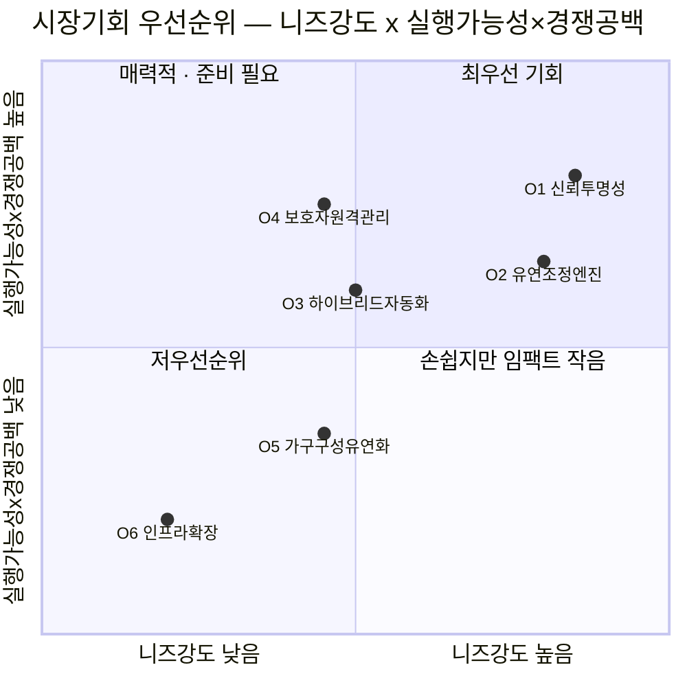

# 25 - 시장기회 분석: AI 자동주문 소량 신선식품 구독 서비스

> 참고 방법론: [[24 - 시장기회 분석 방법론]]
> 참고 자료: [[14 - TAM-SAM-SOM 및 대표 페르소나 분석 (세그먼트당 1인 · 약식) (AI 자동주문 소량 신선식품 구독 서비스)]], [[21 - 페르소나 스펙트럼 분석 보고서 (AI 자동주문 소량 신선식품 구독 서비스)]], [[23 - 고객여정지도 (AI 자동주문 소량 신선식품 구독 서비스)]]
>
> ⚠️ 이 서비스 전용 Five Forces·가치사슬·KSF 문서는 없어(01~17번은 다른 산업 실습용) **경쟁공백** 축은 국내 새벽배송·구독 서비스(마켓컬리, 쿠팡프레시, 오아시스마켓 등)에 대한 일반적 시장 지식으로 정성 평가했습니다.

## 1. CJM Pain Point 종합 → 반복 테마 추출

| 반복 테마 | 등장하는 페르소나 | 패턴 |
| --- | --- | --- |
| **신뢰의 취약성** | C1, C2, C4, C5, N2 | 초기 신뢰가 얕고, 오차·숨은비용·과거실패 경험 한 번으로 쉽게 붕괴 |
| **예외 상황 경직성** | C1, C2, C4, C5 | 스킵·목표변경·예산조정·대체재 안내 같은 예외처리가 AI 자동화의 약점 |
| **자율성-자동화 긴장** | C5, N1 | 완전 자동화가 오히려 "선택의 즐거움"을 빼앗아 거부감을 만듦 |
| **비-본인 의사결정 구조** | C3 | 시니어는 본인이 아니라 자녀가 대리 판단·조작하는 구조 |
| **1인가구 전제의 경직성** | A1, A3 | 가구원수·반려동물 등 1인가구 틀을 벗어나는 순간 서비스가 어색해짐 |
| **구조적 배제** | X1, X2 | 지역 커버리지·접근성 자체가 여정 진입을 원천 차단 |

## 2. 기회 후보 도출 및 평가

| 기회 후보 | 니즈강도 | 경쟁공백 | 실행가능성 | 시장규모 연결 |
| --- | --- | --- | --- | --- |
| **O1. 신뢰 투명성 시스템**(실시간 추천근거·정확도·가격 투명 공개) | 높음 | 중~높음 | 높음 | SOM 전체(4,000억~6,000억원) |
| **O2. 실시간 유연 조정 엔진**(스킵·목표변경·대체재를 즉시 반영) | 높음 | 높음 | 중 | SOM 전체 |
| **O3. 선택권 유지형 하이브리드 자동화**(수동 선택+AI 보조 병행 모드) | 중 | 중 | 높음 | 홈쿡취미형 세그먼트 + N1 전환분 |
| **O4. 보호자 원격관리 인터페이스**(시니어 대리이용 지원) | 중 (세그먼트 한정) | 높음 (거의 공백) | 중 | 시니어 1인가구 세그먼트 |
| **O5. 가구구성 유연화**(인원수·반려동물 파라미터 추가) | 중 | 낮음 (경쟁사도 유사기능 보유) | 높음 | Adjacent 세그먼트 확장분 |
| **O6. 인프라 확장**(지역 커버리지 + 완전 음성접근성) | 낮음 (니치) | 중 | 낮음 (자본·개발비 큼) | X1, X2 해당 인구 |

## 3. 우선순위 매트릭스

## 4. 최우선 기회 상세 서술

### O1. 신뢰 투명성 시스템
- **근거**: CJM에서 C1(첫배송 기대불일치), C2(정밀도 확신 부족), C4(숨은비용), C5(소싱정보 부실), N2(과거 실패 투사) 다섯 곳에서 공통적으로 "신뢰가 한 번에 무너진다"는 패턴이 반복 확인됨.
- **목표 세그먼트**: 전 세그먼트 공통(범용 신뢰 인프라)
- **예상 임팩트**: 신뢰 붕괴로 인한 조기 이탈을 줄여 SOM 전환율 자체를 높이는 **기반 인프라형 기회** — 개별 세그먼트가 아니라 전체 SOM(4,000억~6,000억원)의 전환 효율에 영향
- **실행 조건**: AI 추천 근거를 사용자가 이해할 수 있는 형태로 노출하는 UX, 소싱·가격 정보의 실시간 투명 공개, 오차 발생 시 선제적 알림 체계

### O2. 실시간 유연 조정 엔진
- **근거**: C1(스킵 절차 복잡시 이탈), C2(목표변경 지연반영), C4(예산조정 비유연시 강제이탈), C5(대체재 안내 부재시 계획붕괴) — 예외 상황 대응이 반복적으로 이탈의 방아쇠가 됨.
- **목표 세그먼트**: 시간빈곤형, 헬스지향형, 사회초년생, 홈쿡취미형 (시니어 제외)
- **예상 임팩트**: 기존 새벽배송 구독 서비스 대부분이 "단순 스킵" 기능만 제공하는 데 비해, **AI가 예산·목표 변경을 즉시 재구성**하는 기능은 뚜렷한 차별화 지점이자 경쟁공백
- **실행 조건**: 예외 이벤트(스킵/목표변경/재료품절)를 실시간으로 반영하는 재계산 로직, 대체재 추천 알고리즘

## 5. 주목할 만한 니치 기회

**O4. 보호자 원격관리 인터페이스**는 니즈강도 자체는 시니어 세그먼트에 한정되어 중간 수준이지만, **경쟁공백이 거의 완전한 공백**이라는 점에서 별도로 주목할 가치가 있습니다. 시니어 전용 원격 돌봄과 식품 구독을 결합한 서비스는 국내에 거의 존재하지 않으며, 자녀가 원격으로 부모의 소비·건강 상태를 확인할 수 있는 기능은 시니어 본인뿐 아니라 **비용을 지불하는 자녀(실질적 구매 결정자)**를 직접 타겟팅할 수 있는 기회입니다.

## 6. 결론

CJM에서 드러난 Pain Point 중 **"신뢰"와 "예외 대응"** 두 축이 세그먼트를 가로질러 가장 반복적으로 나타났고, 동시에 실행 가능성과 경쟁공백도 높아 **최우선 기회(O1, O2)**로 확정합니다. **O4(보호자 원격관리)**는 규모는 작지만 경쟁이 전혀 없는 니치이므로 2차 확장 기회로 별도 추적할 가치가 있습니다. 반대로 **O6(인프라 확장)**은 사회적 가치는 있으나 현재 단계의 실행 우선순위로는 부적합합니다.
