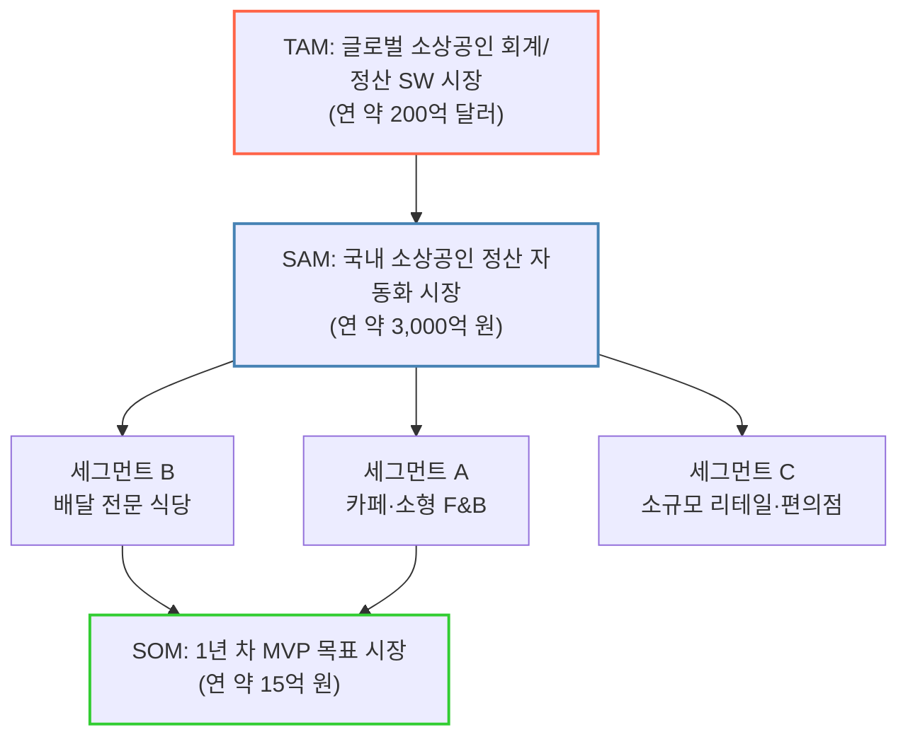
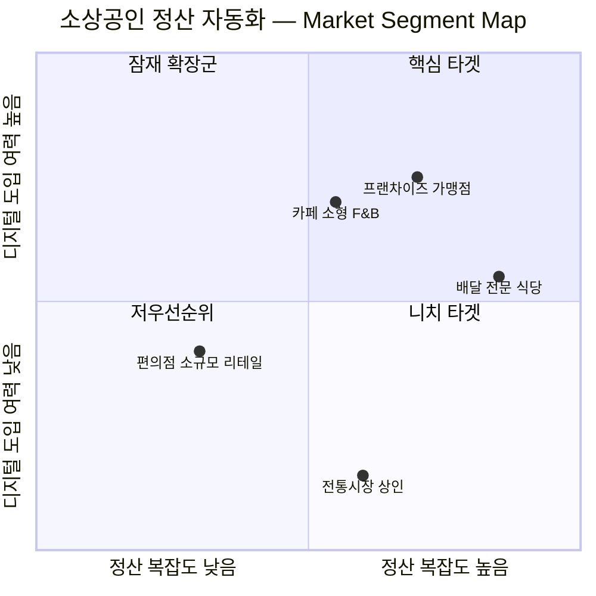

# TAM-SAM-SOM & Market Segment Map — 적용 사례: AI 소상공인 정산 자동화 SaaS

> 원본 자료(글로벌 식량 손실/재분배 플랫폼 사례)의 프레임워크를 다른 시장 — **"AI 기반 소상공인 정산·회계 자동화 SaaS"** — 에 그대로 적용해본 실습 문서입니다. 수치는 공개 시장 리서치 기반 **추정치**이며, 실제 사업 판단에는 별도 검증이 필요합니다.

## 0. 왜 이 시장인가

카드 매출·배달앱 정산·재고를 손으로 맞추는 소상공인이 여전히 많고, 회계 SaaS 시장 자체는 크지만 "소상공인 대상 자동 정산"이라는 좁은 영역은 아직 파편화되어 있습니다. TAM-SAM-SOM으로 "이 시장이 돈이 될 만큼 크면서도, 우리가 지금 당장 점유할 수 있는 좁은 구멍이 있는가"를 확인해봅니다.

---

## 1. TAM · SAM · SOM 정의표

| 구분 | 의미 | 이번 사례 정의 | 규모 (추정) | 근거 |
|---|---|---|---|---|
| **TAM** (Total Addressable Market) | 이론적으로 접근 가능한 전체 수요 | 글로벌 소상공인·중소기업 회계/정산 소프트웨어 시장 | **약 200억 달러 (2026 기준)** | 복수 시장조사 보고서(Business Research Insights, MarkWide Research 등) 교차 확인, 15~24B 달러 범위의 중앙값 |
| **SAM** (Serviceable Available Market) | 우리 서비스가 현실적으로 도달 가능한 영역 | 국내 소상공인 대상 카드·배달앱 정산 자동화 소프트웨어 시장 | **약 3,000억 원 (연간, 추정)** | 국내 소상공인 사업체 수(약 600만) × 정산 자동화 잠재 지불의사(연 5만 원 수준 SaaS 요금) 가정 기반 역산 |
| **SOM** (Serviceable Obtainable Market) | 현재 리소스로 1~2년 내 실현 가능한 목표 범위 | 초기 타깃 3개 업종(카페·배달 전문 식당·소규모 리테일)의 정산 자동화 채택 | **약 15억 원 (연간, 1년 차 MVP 목표)** | SAM의 0.5% — 업종당 약 500개 매장 유료 전환 가정 |

---

## 2. TAM → SAM → Segment → SOM 구조도

> 세그먼트 C(소규모 리테일)는 카드 정산 구조가 상대적으로 단순해 자동화 임팩트가 작다고 보고 1차 타깃에서 제외 — SOM은 세그먼트 A·B 중심으로만 구성.

---

## 3. Market Segment Map — 2×2 매트릭스

**축 설계**: X축 = 정산 복잡도(다채널 정산을 얼마나 많이 손으로 맞춰야 하는가), Y축 = 디지털 도구 도입 여력(사장님의 SaaS 결제 의향·리터러시)

| 사분면 | 세그먼트 | 특징 | 전략 |
|---|---|---|---|
| **Q1 (핵심 타겟)** | 프랜차이즈 가맹점, 배달 전문 식당 | 배달앱 3~4개 동시 운영으로 정산 채널이 많고, 본사·플랫폼 정산 대시보드 사용 경험이 있어 SaaS 도입 저항이 낮음 | **최우선 진입** — 초기 유료 전환 타깃 |
| **Q2 (잠재 확장군)** | 카페·소형 F&B | 정산 복잡도는 중간이지만 사장님이 직접 운영에 매달려 있어 디지털 도구 학습 여력이 낮은 편 | 온보딩을 극단적으로 단순화해야 전환 가능 — 2차 확장 |
| **Q3 (저우선순위)** | 전통시장 상인 | 현금 위주 거래로 정산 자체가 단순하고, 디지털 도구 도입 유인도 낮음 | 이번 SOM에서 제외 |
| **Q4 (니치 타겟)** | 소규모 리테일·편의점 | 정산은 단순하지만 본사 표준 POS를 이미 쓰고 있어 디지털 여력은 있음 | 자체 정산 자동화보다 **API 연동 파트너십**이 더 적합 |

---

## 4. 7단계 워크플로우 매핑 (문제의식 → TAM-SAM-SOM 도출 과정)

| 단계 | 이번 사례에서 한 일 |
|---|---|
| 1. 광범위한 탐색 | "소상공인은 왜 정산을 힘들어할까?"라는 거시 질문에서 시작, 회계 SW 시장 전체 규모 확인 |
| 2. 범위 축소 | 업종(F&B), 채널(카드+배달앱), 지역(국내)으로 좁힘 |
| 3. 핵심 원인 분석 | 정산이 힘든 근본 원인이 "채널별로 정산 주기·수수료 체계가 제각각"이라는 구조적 문제로 좁혀짐 |
| 4. 가설 수립 | "정산 자동화 SaaS는 채널 수가 많을수록(정산 복잡도가 높을수록) 도입 유인이 커진다"는 가설 설정 |
| 5. 정량적 검증 | 업종별 평균 정산 채널 수 vs SaaS 지불의사 데이터를 교차 비교(추정) |
| 6. 반복적 정제 | 세그먼트를 업종 단위에서 "정산 복잡도 × 디지털 도입 여력" 2축 매트릭스로 재구성 |
| 7. 솔루션 구체화 | Q1(배달 전문 식당·프랜차이즈)을 SOM으로 확정, MVP 목표(연 15억 원) 설정 |

---

## 5. 한계 및 다음 확인 사항

- [ ] SAM 산정에 쓰인 "소상공인 지불의사 연 5만 원" 가정은 실제 설문/인터뷰로 검증 필요
- [ ] Q1 세그먼트(배달 전문 식당)의 실제 정산 채널 수·페인포인트는 표본 인터뷰로 재확인 필요
- [ ] TAM 수치는 여러 리서치 기관 추정치의 중앙값이라 리포트마다 최대 ±40% 편차 존재 — 투자 자료용으로 쓸 경우 원본 리포트 재인용 권장

---

*이 문서는 TAM-SAM-SOM 및 Market Segment Map 프레임워크 학습을 위한 적용 실습이며, 실제 사업 타당성 검토를 대체하지 않습니다.*
